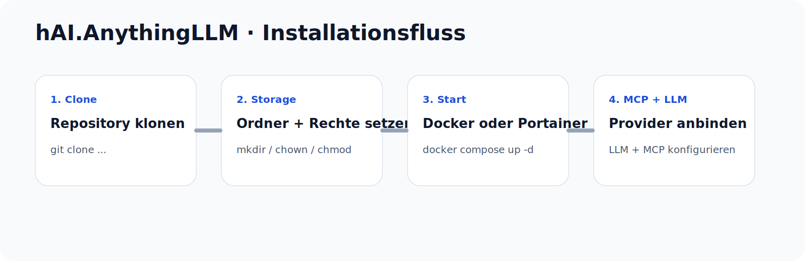

# hAI.AnythingLLM


> Self-hosted AnythingLLM setup mit Docker Compose, Portainer-Stack, persistenter Storage-Struktur, Projektseite und MCP-Hinweisen.

## Vorschau




## Features

- Sauberes Docker-Compose-Setup für AnythingLLM
- Portainer-Stack für schnellen Import
- Vorbereitete Storage-Pfade und Rechte-Hinweise
- Kleine `index.html` Landingpage für das Repo
- MCP-Hinweise für externe Server wie GitHub MCP
- Fehlerhilfe für SQLite- und `Failed to fetch`-Probleme

## Repository-Struktur

```text
hAI.AnythingLLM/
├── README.md
├── docker-compose.yml
├── portainer-stack.yml
├── .env.example
├── index.html
└── assets/
    ├── hAIAnythingLLM-logo.svg
    └── docs/
        └── install-flow.svg
```

## Schnellstart

### 1) Repository klonen

```bash
git clone https://github.com/jbkunama1/hAI.AnythingLLM.git
cd hAI.AnythingLLM
```

### 2) Storage anlegen

```bash
mkdir -p ./storage
sudo chown -R 1000:1000 ./storage
chmod -R 775 ./storage
```

### 3) Stack starten

```bash
docker compose up -d
```

### 4) Weboberfläche öffnen

- `http://SERVER-IP:3001`

## Docker Compose

```yaml
services:
  anythingllm:
    image: mintplexlabs/anythingllm:latest
    container_name: anythingllm
    hostname: anythingllm
    restart: unless-stopped
    ports:
      - "3001:3001"
    environment:
      STORAGE_DIR: /app/server/storage
      HOST: 0.0.0.0
      PORT: 3001
    volumes:
      - ./storage:/app/server/storage
```

## Portainer Stack

```yaml
services:
  anythingllm:
    image: mintplexlabs/anythingllm:latest
    container_name: anythingllm
    hostname: anythingllm
    restart: unless-stopped
    ports:
      - "3001:3001"
    environment:
      STORAGE_DIR: /app/server/storage
      HOST: 0.0.0.0
      PORT: 3001
    volumes:
      - /opt/hAI.AnythingLLM/storage:/app/server/storage
```

Hostpfad vorbereiten:

```bash
mkdir -p /opt/hAI.AnythingLLM/storage
sudo chown -R 1000:1000 /opt/hAI.AnythingLLM/storage
chmod -R 775 /opt/hAI.AnythingLLM/storage
```

## MCP-Server eintragen

AnythingLLM nutzt für MCP-Server eine JSON-Datei namens `anythingllm_mcp_servers.json` im `plugins`-Verzeichnis des Storage-Ordners. Für Docker liegt diese Datei damit typischerweise unter `./storage/plugins/anythingllm_mcp_servers.json`, für Portainer entsprechend unter `/opt/hAI.AnythingLLM/storage/plugins/anythingllm_mcp_servers.json`.

### Beispiel: GitHub MCP als Remote HTTP/SSE

```json
{
  "mcpServers": {
    "github": {
      "type": "http",
      "url": "https://api.githubcopilot.com/mcp/",
      "headers": {
        "X-MCP-Readonly": "true"
      },
      "disabled": false,
      "alwaysAllow": []
    }
  }
}
```

Hinweise:

- Für read-only ist `X-MCP-Readonly: true` sinnvoll.
- Je nach Client- oder Server-Flow kann zusätzlich Auth nötig sein.
- Wenn ein MCP-Server SSE verlangt, wird oft `"type": "sse"` mit passender URL genutzt.

### Beispiel: Lokaler SSE-MCP-Server

```json
{
  "mcpServers": {
    "chrome-control": {
      "url": "http://localhost:3000/sse",
      "disabled": false,
      "alwaysAllow": [],
      "type": "sse"
    }
  }
}
```

### Docker-Pfad anlegen

```bash
mkdir -p ./storage/plugins
nano ./storage/plugins/anythingllm_mcp_servers.json
```

### Portainer-Pfad anlegen

```bash
mkdir -p /opt/hAI.AnythingLLM/storage/plugins
nano /opt/hAI.AnythingLLM/storage/plugins/anythingllm_mcp_servers.json
```

Danach den Container neu starten:

```bash
docker restart anythingllm
```

## GitHub MCP mit Auth

Der offizielle GitHub-MCP-Server unterstützt für Remote-Clients PAT-Authentifizierung per `Authorization: Bearer ...` Header. GitHub nennt außerdem `https://api.githubcopilot.com/mcp/` als Remote-Endpunkt für andere Clients.

### Fertige Datei mit zwei Profilen

Im Repo liegt bereits eine fertige Datei unter `examples/anythingllm_mcp_servers.json`. Sie enthält beide Profile:

- `github-readonly` für lesenden Zugriff
- `github-write` für schreibenden Zugriff, standardmäßig auf `disabled: true` gesetzt

```json
{
  "mcpServers": {
    "github-readonly": {
      "type": "http",
      "url": "https://api.githubcopilot.com/mcp/",
      "headers": {
        "Authorization": "Bearer YOUR_GITHUB_PAT",
        "X-MCP-Readonly": "true"
      },
      "disabled": false,
      "alwaysAllow": []
    },
    "github-write": {
      "type": "http",
      "url": "https://api.githubcopilot.com/mcp/",
      "headers": {
        "Authorization": "Bearer YOUR_GITHUB_PAT"
      },
      "disabled": true,
      "alwaysAllow": []
    }
  }
}
```

### Empfehlung

Starte zuerst mit `github-readonly`. Wenn alles sauber läuft, kannst du `github-write` aktivieren, indem du `disabled` auf `false` setzt und deinem PAT die passenden Schreibrechte gibst. GitHub erlaubt außerdem zusätzliche Header zur Steuerung von Toolsets oder Read-only-Verhalten.

### Wo eintragen

- Docker: `./storage/plugins/anythingllm_mcp_servers.json`
- Portainer: `/opt/hAI.AnythingLLM/storage/plugins/anythingllm_mcp_servers.json`

Danach den Container neu starten:

```bash
docker restart anythingllm
```

### OAuth-Hinweis

GitHub beschreibt für den Remote-MCP-Server auch einen OAuth-Flow, bei dem der Client beim Verbinden authentifiziert wird. Ob das in AnythingLLM direkt sauber unterstützt wird, hängt aber vom MCP-Client-Verhalten ab. Für AnythingLLM ist der pragmatische und verlässlichste Weg derzeit meist der Header mit PAT.

## LLM-Anbindung

Externe LLMs oder OpenAI-kompatible Gateways werden nach dem ersten Login direkt in AnythingLLM konfiguriert. Achte auf korrekte Base-URL, Modellname und Erreichbarkeit aus dem Container.

## Troubleshooting

### SQLite `unable to open database file`

Fast immer ein Rechte- oder Pfadproblem.

```bash
mkdir -p ./storage
sudo chown -R 1000:1000 ./storage
chmod -R 775 ./storage
```

### `Failed to fetch`

Prüfen:

- Läuft der Container stabil?
- Ist das Storage-Verzeichnis beschreibbar?
- Ist der externe LLM-Endpunkt erreichbar?
- Stimmen Reverse-Proxy und TLS?
- Browser-Devtools und `docker logs anythingllm` prüfen.

## GitHub

Ziel-Repository:

- [jbkunama1/hAI.AnythingLLM](https://github.com/jbkunama1/hAI.AnythingLLM)

## Lizenz

MIT
